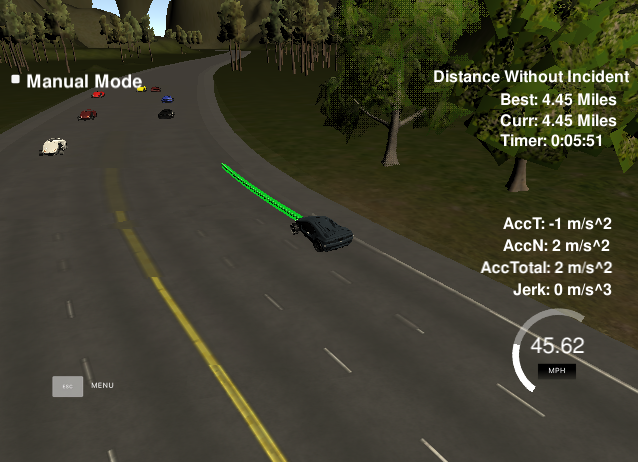

# CarND-Path-Planning-Project
Self-Driving Car Engineer Nanodegree Program
   
<p align="center">
  
</p>

## Introduction
In this project, the goal is to design a path planning algorithms to drive a car in a virtual highway with other cars of different speeds. The information of the traffic, like other cars' localization and speed, is provided by the sensor fusion data from the simulator.


### Objectives
* The car is able to drive at least 4.32 miles without incident.
* The car drives according to the speed limit.
* Max Acceleration and Jerk are not exceeded.
* Car does not have collisions.
* The car stays in its lane, except for the time between changing lanes.
* The car is able to change lanes.


### The highway map data
Each waypoint in the list contains  [x,y,s,dx,dy] values. x and y are the waypoint's map coordinate position, the s value is the distance along the road to get to that waypoint in meters, the dx and dy values define the unit normal vector pointing outward of the highway loop.

The highway's waypoints loop around so the frenet s value, distance along the road, goes from 0 to 6945.554.


## Model details

### Waypoint interpolation
In this part, the provided sparse waypoints are used to generate smooth interpolation lines. The "spline.h" file is used here for the interpolation. Each point in the Frenet coordinates can be converted to the Cartesian coordinates through the interpolation lines.

### Tracking Traffic Information
The nearby cars' information is very important for avoiding collision. The program uses the sensor fusion data to find the speeds and locations of cars in a given range of the ego car. Then it store them in order for providing information to help ego car choose right lane.

### States
The car has 5 different states: 
* keep lane (KL)
* prepare lane change left (PLCL)
* prepare lane change right (PLCR)
* lane change left (LCL)
* lane change right (LCR). 

The initial state is keep lane. The "KL" state is always followed by "KL", "PLCL", or "PLCR"; The "PLCL" ("PLCR") is always followed by "KL", "PLCL" ("PLCR"), or "LCL" ("LCR"); The "LCL" ("LCR") is always followed by "KL".


### Path Generation
For each state, the program can generate different target end point for the car and then compare them to find the best path. 
* In the "KL" state, if there is no vehicle in front of the ego car, it would follow a target speed of 21 m/s; otherwise, it would follow the front car as the same speed.
* In the "PLCL" ("PLCR") state, the program checks nearby cars in the left (right) lane to see if there is any enough space for the ego car to change the lane.  
* In the "LCL" ("LCR") state, the ego car would follow the lane change trajectory until it goes to the center of the target lane. 

Each state generates an predicted speed after a 2 seconds time window. The state with fastest speed would be chosen as the next state.


### Jerk Minimizing Trajectory 
After a new state is chosen, the program will have a start point and an end point. With these two points in hand, we can create a 5th order polynomial to find a trajectory of minimum jerk.  


<p align="center">
  
</p>


## Simulator.
You can download the Term3 Simulator which contains the Path Planning Project from the [releases tab (https://github.com/udacity/self-driving-car-sim/releases/tag/T3_v1.2).


## Basic Build Instructions

1. Clone this repo.
2. Make a build directory: `mkdir build && cd build`
3. Compile: `cmake .. && make`
4. Run it: `./path_planning`.

Here is the data provided from the Simulator to the C++ Program

#### Main car's localization Data (No Noise)

["x"] The car's x position in map coordinates

["y"] The car's y position in map coordinates

["s"] The car's s position in frenet coordinates

["d"] The car's d position in frenet coordinates

["yaw"] The car's yaw angle in the map

["speed"] The car's speed in MPH

#### Previous path data given to the Planner

//Note: Return the previous list but with processed points removed, can be a nice tool to show how far along
the path has processed since last time. 

["previous_path_x"] The previous list of x points previously given to the simulator

["previous_path_y"] The previous list of y points previously given to the simulator

#### Previous path's end s and d values 

["end_path_s"] The previous list's last point's frenet s value

["end_path_d"] The previous list's last point's frenet d value

#### Sensor Fusion Data, a list of all other car's attributes on the same side of the road. (No Noise)

["sensor_fusion"] A 2d vector of cars and then that car's [car's unique ID, car's x position in map coordinates, car's y position in map coordinates, car's x velocity in m/s, car's y velocity in m/s, car's s position in frenet coordinates, car's d position in frenet coordinates. 

## Details

1. The car uses a perfect controller and will visit every (x,y) point it recieves in the list every .02 seconds. The units for the (x,y) points are in meters and the spacing of the points determines the speed of the car. The vector going from a point to the next point in the list dictates the angle of the car. Acceleration both in the tangential and normal directions is measured along with the jerk, the rate of change of total Acceleration. The (x,y) point paths that the planner recieves should not have a total acceleration that goes over 10 m/s^2, also the jerk should not go over 50 m/s^3. (NOTE: As this is BETA, these requirements might change. Also currently jerk is over a .02 second interval, it would probably be better to average total acceleration over 1 second and measure jerk from that.

2. There will be some latency between the simulator running and the path planner returning a path, with optimized code usually its not very long maybe just 1-3 time steps. During this delay the simulator will continue using points that it was last given, because of this its a good idea to store the last points you have used so you can have a smooth transition. previous_path_x, and previous_path_y can be helpful for this transition since they show the last points given to the simulator controller with the processed points already removed. You would either return a path that extends this previous path or make sure to create a new path that has a smooth transition with this last path.


---

## Dependencies

* cmake >= 3.5
  * All OSes: [click here for installation instructions](https://cmake.org/install/)
* make >= 4.1
  * Linux: make is installed by default on most Linux distros
  * Mac: [install Xcode command line tools to get make](https://developer.apple.com/xcode/features/)
  * Windows: [Click here for installation instructions](http://gnuwin32.sourceforge.net/packages/make.htm)
* gcc/g++ >= 5.4
  * Linux: gcc / g++ is installed by default on most Linux distros
  * Mac: same deal as make - [install Xcode command line tools]((https://developer.apple.com/xcode/features/)
  * Windows: recommend using [MinGW](http://www.mingw.org/)
* [uWebSockets](https://github.com/uWebSockets/uWebSockets)
  * Run either `install-mac.sh` or `install-ubuntu.sh`.
  * If you install from source, checkout to commit `e94b6e1`, i.e.
    ```
    git clone https://github.com/uWebSockets/uWebSockets 
    cd uWebSockets
    git checkout e94b6e1
    ```

## Editor Settings

We've purposefully kept editor configuration files out of this repo in order to
keep it as simple and environment agnostic as possible. However, we recommend
using the following settings:

* indent using spaces
* set tab width to 2 spaces (keeps the matrices in source code aligned)

## Code Style

Please (do your best to) stick to [Google's C++ style guide](https://google.github.io/styleguide/cppguide.html).

